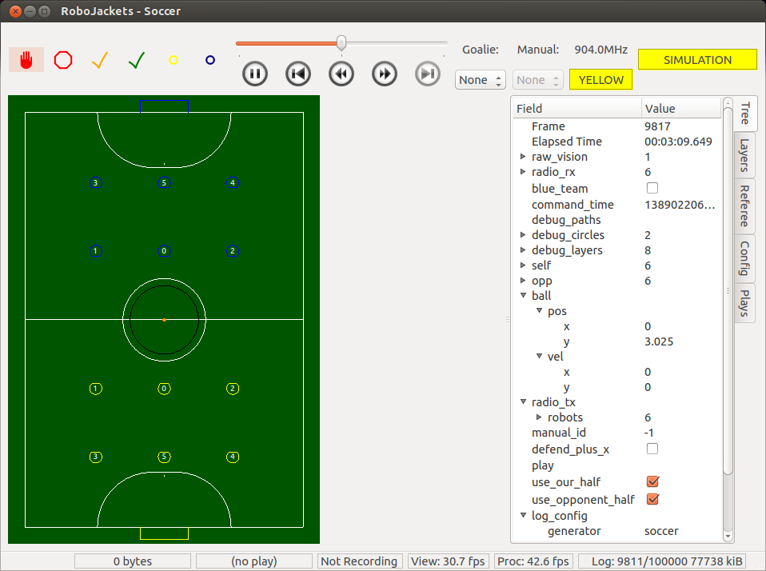

# GT RoboJackets RoboCup SSL [](https://travis-ci.org/RoboJackets/robocup-software)


The Georgia Tech RoboJackets team competes in the annual RoboCup Small Size League (SSL) competition.  This repository contains all of the software that we run on the main field laptop and on our robots.  More information on how our software works can be found on our [documentation page](http://robojackets.github.io/robocup-software/), our [wiki](http://wiki.robojackets.org/w/RoboCup_Software) or on our [website](http://www.robojackets.org/).
Also, check out our [2014 qualification video](https://www.youtube.com/watch?v=H3F9HexPLT0) to see our robots in action!

Here is a screenshot of our 'soccer' program:



## The Competition

The soccer game is played between two teams of six robots each on a field with overhead cameras.  The field vision computer processes images from the cameras and sends out (x,y) coordinates of the ball and the robots.  Each team has a laptop that accepts the data from the vision computer and uses it to strategize, then send commands to robots on the field.

The official [RoboCup site](http://robocupssl.cpe.ku.ac.th/) has more information on the competition.


## Project Layout

### soccer/

The soccer folder contains the code to build the 'soccer' program, which is the main program in control when running our robots.


### simulator/

Code for the RoboCup simulator is located here.  This allows us to quickly test our soccer strategy on the computer.  Keep in mind though that just because something works well in the simulator doesn't mean it'll be the same in real life.


### firmware/

The firmware folder contains the code that runs on the robot (soccer/robot) and on the radio base station.  See the firmware/robot [README](firmware/robot/README.md) for more info.


### common/

Code that's shared between the different programs in our project is stored here.


### run/

Compiled programs and some configuration files are stored here.


## Setup

Here's a quick guide to getting this RoboCup project setup on your computer.  We recommend and only provide directions for installing on Ubuntu Linux, Arch Linux, and Mac OS X, although it shouldn't be too difficult to port to other operating systems.

1) Clone the repository

```
git clone git://github.com/RoboJackets/robocup-software
```


2) Install the necessary software

There are a few setup scripts in the util directory for installing required packages, setting up udev rules, etc.  See `ubuntu-setup`, `arch-setup`, and `osx-setup` for more info.

```
$ cd robocup-software
$ util/<SYSTEM>-setup
```

3) Build the project

```
$ make
```

We use CMake as our build system and have a simple `makefile` setup that invokes CMake.

After running `make`, several programs will be placed in the **run** folder.  See the [soccer docs](http://robojackets.github.io/robocup-software/md_soccer_doc__soccer.html) for instructions on running the soccer program.


## Documentation

We use [Doxygen](www.doxygen.org) for documentation.  This allows us to convert specially-formatted comments within code files into a nifty website that lets us easily see how things are laid out.  Our compiled doxygen documentation can be found here:

http://robojackets.github.io/robocup-software/

Note: The doxygen documentation site above is updated automacally using travis-ci.  See our .travis.yml file for more info.

## Testing
We use [gtest](https://code.google.com/p/googletest/) for unit-testing our software, which can be run by running `make tests`.  To add a test to be run with the rest of the bunch, add a new file in soccer/tests.
