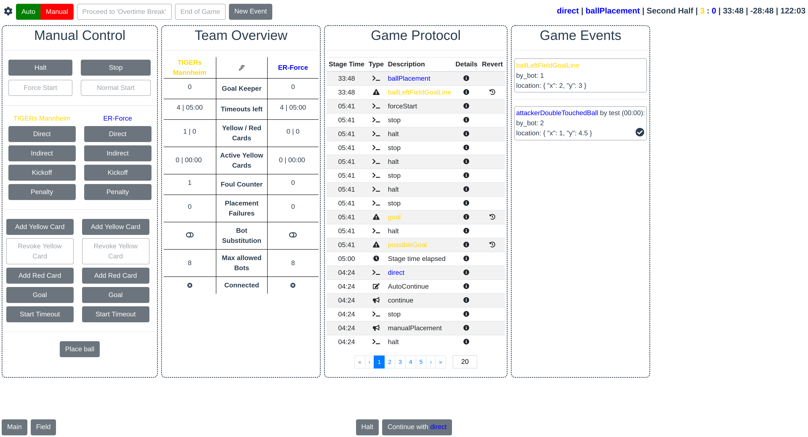

FAQ
===================================================
This page will contain information on topics outside the stack itself, like how
to debug code, learn C++, or write good ROS code.

How do I debug my code?
--------------------------------------------------

In Python, the best way is to set up print() statements and print out relevant
variables. Python is an interpreted language, meaning there's no easy way for
us to step through it with a debugger.

In C++, you can achieve a similar debug-by-print with SPDLOG.

    1. Add ``#include <spdlog/spdlog.h>`` in your header file.
    2. Add some lines like ``SPDLOG_INFO("VARIABLE_NAME = {}", variable_name);``

There are examples of SPDLOG used in our codebase for error messages. Grep for
``SPDLOG`` and you'll find some (if you don't know how, see our Tutorial).

If that fails, in C++, we also have the option of compiling in debug mode, and
then setting up a debugger. This is actually quite simple!

In particular, we have had success using `LLDB <https://lldb.llvm.org/>`_,
made by the same group that develops the clang compiler.

As of winter 2022, the ubuntu-setup script installs clang-10 using a script
which also includes lldb-10 (so you should not need to install anything new for
this).

All you need to do is start soccer or sim in one terminal tab, and in another
tab, ``ros2 run --prefix 'lldb-10 run' rj_robocup executable_name``.

If that doesn't work for some reason, another way is to run the executable
without the prefix (``ros2 run rj_robocup executable_name``). Then attach to
this executable by running ``sudo lldb-10 -n name_of_particular_proc``. This
method is not as good as the previously described one, but I included it for
completeness. (-Kasra)

**How do you find this particular name?**

It depends on what file/node you wish to debug.

As of the time of writing, we do not use any ros2 node composition, so each
node is its own process. Looking in the soccer launch file a node's
"executable_name" corresponds to the process name to place after ``-n``. 

Another method to find the process names of nodes is to run ``top`` in a new
terminal tab and look in there.

**How do you use lldb?**

Google what you want to do and follow the top result or follow the lldb
tutorial on their website.

CS2110 and CS2200 will introduce you to gdb, which is another debugger for
C/C++; if you already know that, the commands are basically the same (the
syntax is different in many places though).

C++ is hard. Where can I get better at it?
--------------------------------------------------

One of the authors of these docs recommends `LearnCpp
<https://www.learncpp.com/>`_. It is very thorough, and assumes no prior
experience. This particular author went through ~80% of the site in a week to
prepare for a C++ interview with a self-driving car company. This is not the
recommended approach, but it worked: he got the job!

Why do we use ROS?
--------------------------------------------------

Political answer: because all the other RJ teams agreed to around 2020, so we
rewrote a large portion of our codebase to follow suit. (This is why old
screenshots show our UI with more functionality than new ones.)

Technical answer: to allow for easy multithreading. 

ROS is designed to be a catalog of robotics tools that are easy to
plug-and-play, hence the strict typing for msgs and large number of external
packages. However, RoboCup SSL is such a weird robotics application that a lot
of the most popular ROS tools don't help us. 

For instance, there is a whole ROS2 package to handle `localization and sensor
fusion
<https://automaticaddison.com/sensor-fusion-using-the-robot-localization-package-ros-2/>`_,
which is a challenging problem that someone has solved for you! However, we
simply have no need to localize thanks to our competition's overhead camera.
There's a ROS2 application to allow for 3D modeling and simulation called
`Gazebo
<https://automaticaddison.com/how-to-simulate-a-robot-using-gazebo-and-ros-2/>`_!
However, we have ER-force for physics simulation and our UI for visualization
(or SSL Game Controller if that fails).

So we primarily use ROS as a way to create a multithreaded application, with a
built-in messaging framework and introspection tools, rather than as a library
of useful robotics software to build upon. 

Is it overkill? Probably. But hopefully it will teach you a valuable industry tool
along the way.

How do I learn more about ROS?
--------------------------------------------------

Generally, our tutorial should guide you through all ROS knowledge you'll need
to be successful in RoboCup. If you need more advanced ROS, the `official
documentation <https://docs.ros.org/en/foxy/index.html>`_ contains plenty of
tutorials to help you out!

How should I use ROS msgs in my code?
--------------------------------------------------

In a large codebase such as this one, it is best to leave all interfacing with
ROS .msg types **strictly to ROS nodes**. This is because the autogenerated
structs for ROS msgs are limited in functionality, so passing around raw msgs
in custom classes may lead to limited or unexpected behavior.

In general, follow these guidelines:

    * Leave ROS msg interfacing strictly to ROS nodes.
    * When adding a new ROS msg type, create a C++ struct/class to represent that
      msg type in C++ classes outside of ROS nodes. This will allow you to add
      functionality that the ROS msg may not have. An example of this is
      ``Trajectory.msg/trajectory.hpp``.
    * At the bottom of your custom C++ struct/class, add a template method under
      ``namespace rj_convert`` in order to convert to/from ROS easily. (Again, see
      ``trajectory.hpp``.) This will generate two methods:
      ``rj_convert::convert_to_ros()`` and ``rj_convert::convert_from_ros()`` for
      ease of conversion.

What is a .launch file?
--------------------------------------------------

A .launch file is how ROS knows what nodes to launch and where to look for
them.

Our launch files are pretty similar to the ones introduced in `ROS wiki
tutorials
<https://docs.ros.org/en/foxy/Tutorials/Intermediate/Launch/Creating-Launch-Files.html>`_,
but we also use flags on launch to easily switch between certain nodes (for
example we can switch between sim radio and network radio by setting a
particular to the proper boolean value). Alias for common launch configurations
can be found in the makefile.

What is a build system?
--------------------------------------------------

A build system is an easy way to ensure many source code files end up as one
program. In C/C++, a build system will compile all the files you ask it to,
then link those files together and spit out a single executable.

We use cmake and ninja. We prefer using clang as the C++ compiler compared to
gcc, but either will work. If you've gone through the tutorial, you've already
been using our build system with commands like ``make perf`` and ``make
again``!

Most of the details on the high-level construction of our build system can
been ascertained by reading the root ``CMakeLists.txt``.

If you are adding a new C++ file, it is best to just follow the existing
format by reading through ``CMakeLists.txt`` in the relevant directories.
(CMake is notoriously hard to learn.)

What is continuous integration?
--------------------------------------------------

Continuous integration (CI) is how we ensure code merged into our main branch
isn't hopelessly broken. Currently, we run basic unit tests, a test to ensure
our code builds (known as a "smoke test"), and a style checker. Our CI also
generates warnings and annotates PR code with them.

To do this, we use Github Actions. The configuration for that can be found in
``.github/workflows``.

How do I run the external referee?
--------------------------------------------------

First, read the Referee section of the Our Stack page and `this section
<https://robocup-ssl.github.io/ssl-rules/sslrules.html#_game_controller>`_ of
the rulebook. This will give you some background on what the SSL Game
Controller does. This program is given by the league and helps simulate what it
will be like at competition, where the (human) referee sits at a different
computer to the one that runs our software and gives game commands from there.

Installation is simple. First, create an empty directory named
``ssl-game-controller`` at the same level as your clone of
``robocup-software``::

    ~/coding/robocup/
    ├── robocup-software/
    ├── ssl-game-controller/

Then, download the latest release binary in the `SSL GC repo
<https://github.com/RoboCup-SSL/ssl-game-controller>`_ and put it into that
folder. Finally, make the release binary executable by ``cd`` ing to the
``ssl-game-controller`` repo and running ``chmod +x <name of release binary>``.

When you want to launch the game controller, ``cd`` to your
``ssl-game-controller`` directory and run the release binary with ``./<name of
release binary>``. (You can tab-complete this by typing ``./`` and then hitting
tab.) The binary will output a message saying it has launched the UI at a
specific URL--click that link to open the UI. 

Operation instructions can be found in the FAQ of the SSL GC repo.

How do I add to these docs?
----------------------------------------------

See "Meta Docs" for information on adding to documentation.
