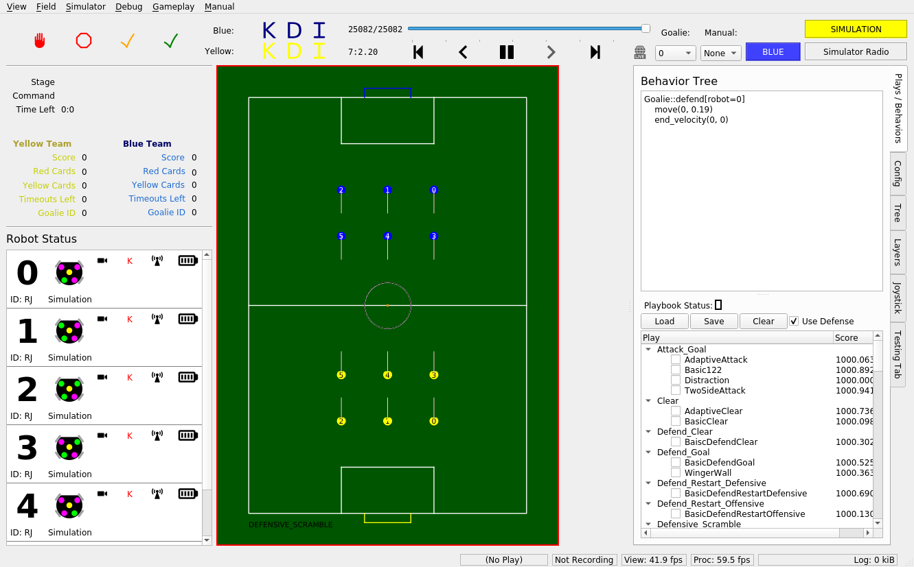

Getting Started
===============

.. note:: 
   If you are completely unfamiliar with the command line or basic git
   usage, see the Tutorial page before proceeding. 

Installation
------------

We only provide official support for Ubuntu 20.04 due to ROS2. Make sure you
are on an Ubuntu 20.04 machine before continuing.

First, clone the repository from GitHub:

.. code-block:: bash

   git clone https://github.com/RoboJackets/robocup-software.git

Then change directories (``cd``) to the repository you just cloned, and run the
setup script to install all required dependencies:

.. code-block:: bash

    cd robocup-software
    ./util/ubuntu-setup

And setup git submodules:

.. code-block:: bash

    git submodule init
    git submodule update

Running The First Time
----------------------

Let's run the stack! To simulate the vision data we'd get from a real field
camera setup, we'll use ER-Force's simulator.

To start, clone their repo, and ``cd`` into it.

.. code-block:: sh

   git clone https://github.com/robotics-erlangen/framework.git
   cd framework

Then, build their code with the following:

.. code-block:: sh

    mkdir build && cd build
    cmake ..
    make simulator-cli

This builds an executable in ``framework/build/bin``. Like any other
executable, it can be run with ``./[filepath-to-executable]``. Since we're
already in the ``framework/build/`` directory, simply run:

.. code-block:: sh

   ./bin/simulator-cli

Note that the absolute filepath works from anywhere:

.. code-block:: sh

   ./framework/build/bin/simulator-cli

We're a Division B team, so add the flag `-g` and the option `2020B` to use the
Division B field dimensions, like so:

.. code-block:: sh

   ./bin/simulator-cli -g 2020B

For whatever reason, this program has no output, but it will become obvious
after you start our UI whether or not you've done this step correctly.

Now, make sure you're on the most updated version of ``ros2`` branch. This is
where the latest working version of our codebase exists. (See "Github" doc.
--TODO(Prabhanjan): transfer this to docs--)

.. code-block:: bash

    git pull
    git checkout ros2

Then, source the ROS setup file. This allows your shell to use ROS commands.

.. code-block:: bash

    source /opt/ros/foxy/setup.bash

If you're on zsh, source the ``.zsh`` version instead. (If you don't know what
zsh is, you're not on zsh.)

.. code-block:: bash

    source /opt/ros/foxy/setup.zsh

Then build the codebase. This compiles all of our code.

.. code-block:: bash

   make perf

(This step will take upwards of 15 minutes on a VM.)

After building, we need to source our custom ROS setup. Run the following in
the ``robocup-software`` directory:

.. code-block:: bash

    source install/setup.bash

Again, if you're on zsh, source the ``.zsh`` version instead:

.. code-block:: bash

    source install/setup.zsh

Now we are good to go. As a sanity check, the following command should print
out ``rj_robocup``:

.. code-block:: bash

    ros2 pkg list | grep rj_robocup

To launch our stack, which contains our AI plus a UI to show what's happening,
run the following:

.. code-block:: bash

    ros2 launch rj_robocup sim.launch.py

If everything is working properly, you should see the following window show up.

Running Again
-------------

Now that you know how to source dependencies, build, and run our code, you can
take advantage of some neat shortcuts. These shortcuts all depend on the
following knowledge:

Sourcing only needs to happen every time a new terminal is opened, and
building only needs to happen when C++ or launch.py files are changed.

(Python is not a compiled language; thus, those files do not need to be built
when changed.)

So, after you've built once, the ``install/setup.bash`` script will exist in
your version of the repo, and you won't have to build again until you make
changes to C++ or launch files. That means the next time you open up a new
terminal, you can launch sim with:

.. code-block:: bash

   . ./source.bash
   make run-sim

``source.bash`` is an alias for the two source commands in the above section,
and ``make run-sim`` is an alias for ``ros2 launch rj_robocup sim.launch.py``.

Since Python is not compiled, if you're exclusively working on Python files,
and staying in one terminal, it's likely that you'll mostly only need:

.. code-block:: bash

   make run-sim

However, if you're working on C++ or launch files (or if someone else changes
them on a different branch and you want their changes), you'll need to build
again. If you've already built once on your machine, though, you can build
again more quickly with:

.. code-block:: bash

   make again
   . ./source.bash

The ``source.bash`` line is necessary to source the file in ``install/``, which
is refreshed on each build. (**Note:** this does not build any CMake-related
files, so if you're editing those, use ``make perf`` as usual.)

There are a few different ways to build our code. See the makefile for more
details, but in short:

.. code-block:: bash

   make all         # builds with full debugging symbols
   make debug       # alias for make all
   make all-release # builds with 0 debugging symbols
   make perf        # builds with some debugging symbols; preferred method

TODO(Kevin): add description of running on field comp (move that md file over too)
