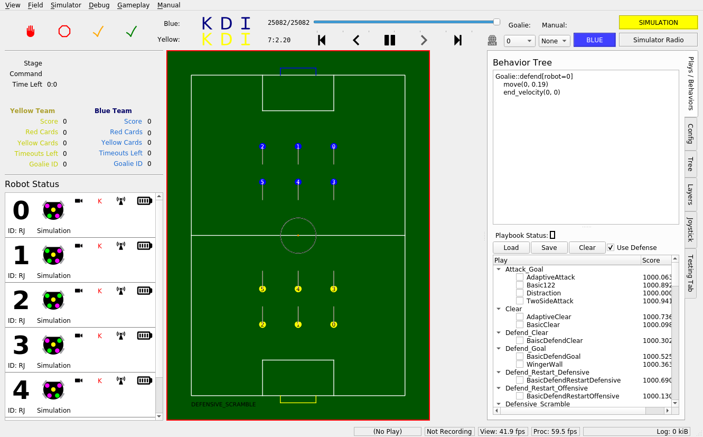

Installation
======================================

.. note:: 
   If you are completely unfamiliar with the command line or basic git
   usage, see the Tutorial page before proceeding. 

We only provide official support for Ubuntu 20.04 due to ROS2. Make sure you
are on an Ubuntu 20.04 machine before continuing. For Windows users, using WSL2
with Ubuntu 20.04 will work. The steps to set this up can be found `here
<https://ubuntu
.com/tutorials/install-ubuntu-on-wsl2-on-windows-10#1-overview>`_. For Mac
users, Ubuntu 20.04 can be emulated in a virtual machine. For M1 Macs
specifically, using the arm64 version of Ubuntu 20.04 with the application UTM
has worked in the past.

First, clone the repository from GitHub:

.. code-block:: bash

   git clone https://github.com/RoboJackets/robocup-software.git

Then ``cd`` to the repository you just cloned, and run the setup scripts to
install all required dependencies:

.. code-block:: bash

    cd robocup-software ./util/ubuntu-setup && ./util/git-setup

To simulate the vision data we'd get from a real field camera setup, we'll use
ER-Force's simulator. For that, clone their repo, and ``cd`` into it.

.. code-block:: sh

   git clone https://github.com/robotics-erlangen/framework.git
   cd framework

Then, build their code with the following:

.. code-block:: sh

    mkdir build && cd build
    cmake ..
    make simulator-cli

This builds an executable in ``framework/build/bin``. Like any other
executable, it can be run with ``[filepath-to-executable]``. Since we're
already in the ``framework/build/`` directory, simply run:

.. code-block:: sh

   ./bin/simulator-cli

Note also that the absolute filepath works from any directory:

.. code-block:: sh

   ~/framework/build/bin/simulator-cli

We're a Division B team, so add the flag `-g` and the option `2020B` to use the
Division B field dimensions, like so:

.. code-block:: sh

   ./bin/simulator-cli -g 2020B

Sadly, this program has no output, so when you run it nothing will appear to
happen. However, it will become obvious after you start our UI whether or not
you've correctly started the simulator or not.

In another terminal, change directories back into ``robocup-software``.
Make sure you're on the most updated version of ``ros2`` branch. This is
where the latest working version of our codebase exists. (See Contributing page for
more information).

.. code-block:: bash

    git pull 
    git checkout ros2

Then, source the ROS setup file. This allows your shell to use ROS commands.

.. code-block:: bash

    source /opt/ros/foxy/setup.bash

If you're on zsh, source ``setup.zsh`` instead. (If you don't know what
zsh is, you're not on zsh.)

Then build the codebase. This compiles all of our code. On a VM, this step will
take upwards of 15 minutes.

.. code-block:: bash

   make perf

After building, we need to source our custom ROS setup. Run the following in
the ``robocup-software`` directory:

.. code-block:: bash

    source install/setup.bash

(Again, if you're on zsh, source the ``.zsh`` version instead.)

Now we are good to go. As a sanity check, the following command should print out
``rj_robocup``:

.. code-block:: bash

    ros2 pkg list | grep rj_robocup

To launch our stack, which contains our AI that sends commands to the
simulator, plus a UI to show what's happening, run the following:

.. code-block:: bash

    ros2 launch rj_robocup soccer.launch.py

If everything is working properly, you should see the following window show up.

Shortcuts
---------

Now that you know how to source dependencies, build, and run our code, you can
take advantage of some neat shortcuts. These shortcuts all depend on the
following knowledge:

Sourcing only needs to happen every time a new terminal is opened, and building
 needs to happen when C++ or launch.py files are changed. 

So, after you've built once, the ``install/setup.bash`` script will exist in
your version of the repo, and you won't have to build again until you make
changes to C++ or launch files. That means the next time you open up a new
terminal, you can launch sim with:

.. code-block:: bash

   . ./source.bash 
   make run-sim

``source.bash`` is an alias for the two source commands you saw above, and
``make run-sim`` will launch both ER-Force's Framework (the physics simulator)
and our stack (``ros2 launch rj_robocup sim.launch.py``). 

To stop this process (like any other) press CTRL-C in the command line. You may
have to press CTRL-C twice.

.. code-block:: bash

   make run-sim

When you make changes to any C++ files, you'll need to build
again to see your changes take effect. If you've already built once on your
machine, though, you can build again more quickly with:

.. code-block:: bash

   make again 
   . ./source.bash

The ``source.bash`` line is necessary to source the file in ``install/``, which
is refreshed on each build. (**Note:** this does not build any CMake-related
files, so if you're editing those, use ``make perf`` as usual.)

There are a few different ways to build our code. See the makefile for more
details, but in short:

.. code-block:: bash

   make all         # builds with full debugging symbols 
   make debug       # alias for make all 
   make all-release # builds with 0 debugging symbols 
   make perf        # builds with some debugging symbols; preferred method

TODO(Kevin): add description of running on field comp (move that md file over
too)
