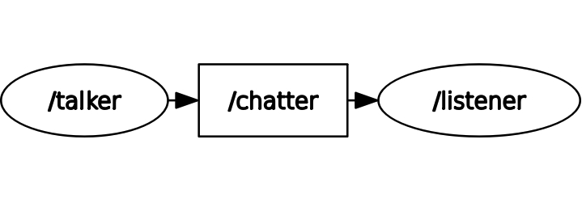
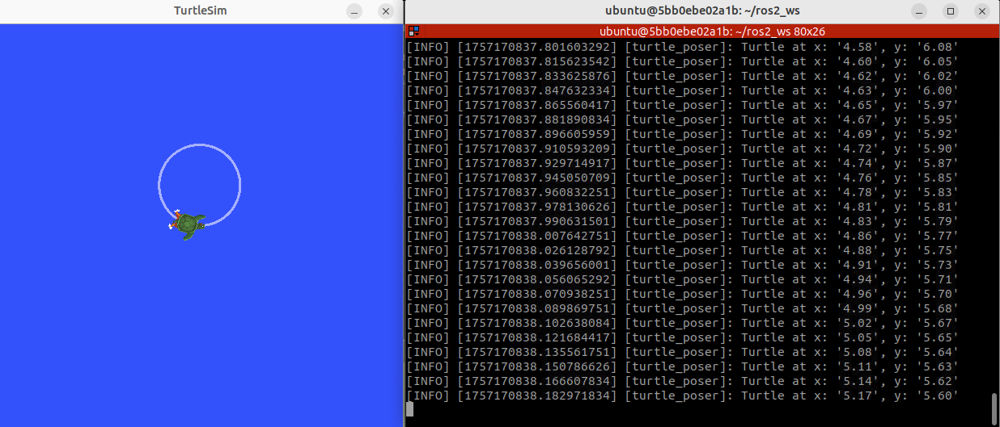

ROS & C++ Introduction
======================================
This page is meant to serve as an introduction to core ROS concepts and a little bit
of C++. While this won't serve as a full-fledged tutorial, this will get you primed
for the main tutorial that you'll work on in the next section.

This introduction is structured as follows.

.. contents::

0. Setup
--------
For the purposes of this introduction, we'll work in a completely different environment.
To get started, make sure you have Docker setup. You can find more information on setting up Docker
:ref:`here <docker-setup>`, though you should 
**not install the RoboCup Docker image - we'll be using a different one.**

To get the docker image, run the following in your terminal:

.. code-block:: sh

    docker run -p 6080:80 --security-opt seccomp=unconfined --shm-size=512m ghcr.io/tiryoh/ros2-desktop-vnc:humble

You should see a container automatically generate. Click on one of the available ports, and if needed,
enter in the password ``ubuntu``.

For this introduction, you will be working with this Docker container. The best practice for using
this Docker container would be to use the Remote Explorer extension on your local copy of VSCode and
write all of your code there. If there's ever a time you need to use the terminal, you can use
the terminator app in your Docker image.

To set up your local version of VSCode, head over to the Remote Explorer extension, and select
the Dev Containers option at the top. You should then see your newly added container,
which starts with ``ghcr.io``. You should open the ``/home/ubuntu`` folder for now.

.. note::

    When running the terminal, you might have to run ``cd home/ubuntu/`` before you
    can proceed with any of the commands specified later in this tutorial.

1. Trying out ROS 2
-------------------
Before we actually do any coding, let's try out some ROS 2 commands so you can start
to get a feel for how this all works. Afterwards, we will explore some important
ROS fundamentals. 

To get started, open up 3 separate Terminator windows. Once you've done that:

1. In the first window, run:

   .. code-block:: bash

      ros2 run demo_nodes_cpp talker

2. In the second window, run:

   .. code-block:: bash

      ros2 run demo_nodes_cpp listener

3. In the third window, run:

   .. code-block:: bash

      rqt_graph

You should see 3 different things happening:
1. One terminal window is constantly printing out a ``Hello World`` message with a number.
2. Another terminal is somehow picking up the messages being outputted by the first terminal.
3. A graph that shows the relationship between the 2 commands that we just ran. (If you cannot
see both the talker and the listener, hit the refresh button at the top left of the rqt app).

2. What Just Happened?
----------------------
Fundamentally, ROS is structured around these things called **nodes**. You can think of nodes
as just independent programs running in your ROS system. Each node is designed to handle 1 specific
task.

From the commands we just ran, we spun up two different nodes.

#. The ``/talker`` node. Its job was to **create** and **broadcast** a simple message
   over and over again.
#. The ``/listener`` node. Its job is to listen for messages from the ``/talker`` node.

We can be a bit more specific here. The ``/talker`` node is called a **publisher**, and the 
listener node is called a **subscriber**. Can you infer why we call them those names?

So how exactly the ``/listener`` node get the details from the ``talker`` node? **Topics.**
Nodes rely on a channel to send and receive information. This channel is a topic.

In our example, the ``/talker`` node is publishing messages to the ``/chatter`` topic.
The ``/listener`` node subscribes to the ``/chatter`` topic and receives any messages
that are published to the ``/talker`` node.

Lastly, the ``rqt_graph`` let's us see all of this visually. You should see something similar to this:

Once you feel comfortable with these ideas, do some more reading and testing with publishers,
subscribers, and topics here:

1. `Understanding ROS 2 Nodes <https://docs.ros.org/en/humble/Tutorials/Beginner-CLI-Tools/Understanding-ROS2-Nodes/Understanding-ROS2-Nodes.html>`_.
2. `Understanding ROS 2 Topics <https://docs.ros.org/en/humble/Tutorials/Beginner-CLI-Tools/Understanding-ROS2-Topics/Understanding-ROS2-Topics.html>`_.

3. Building Your Own Publisher
------------------------------
Now that we know the basics of nodes and topics, the nest step is to actually get started
with coding up our very own publisher and subscriber. For this project, we're going to dive
deeper into figuring out how to actually get the Turtle in TurtleSim to move in a circle.

.. note::
    While this introduction isn't meant to serve as a full-blown introduction to C++,
    we will be having weekly 30-45 minute sessions that go over C++ fundamentals. C++
    is quite a large and heavy language to learn, so we recommend taking your time through
    all the code that we will be writing and make sure you understand it before proceeding.
    We will also include some recommended C++ resources for you to review at the end of this page.

Project Setup & Command Line
~~~~~~~~~~~~~~~~~~~~~~~~~~~~
Before you get started, it's important to know some essential command-line basics. Here are two
resources that we recommend:

#. `Command-line basics (video) <https://www.youtube.com/watch?v=5XgBd6rjuDQ>`_
#. `Ubuntu: Command line for beginners <https://ubuntu.com/tutorials/command-line-for-beginners#1-overview>`_

The first thing we need to do is **setup our workspace** and create a C++ package that will
hold all of our code. You'll notice that ROS works on the concept of workspaces - the main advantage
here is that we can use a structured environment generated by ROS to write all of our code in, and it's
easy to integrate your own packages on top of existing ROS packages.

Start by creating a new directory for your workspace inside your ``home`` directory:

1. Create the workspace and source folder:

   .. code-block:: bash

      mkdir -p ~/ros2_ws/src

2. Change into the source folder:

   .. code-block:: bash

      cd ~/ros2_ws/src

Next, we need to create a C++ package. Our project name will be called ``turtlesim_project``.
When creating a project, you will also need to specify all the dependencies that your project uses:

.. code-block:: bash

    ros2 pkg create --build-type ament_cmake --dependencies rclcpp geometry_msgs turtlesim -- turtlesim_project

Here, the 3 dependencies we have are ``rclcpp``, ``geometry_msgs``, and ``turtlesim``. You'll see why these
are relevant in just a moment.

Next, open up VSCode and find the folder that you just created. We will now begin coding our publisher.

Coding the Publisher
~~~~~~~~~~~~~~~~~~~~~~~~~~~~
To start, first create a new file in the ``ros2_ws/src/turtlesim_project/src/`` directory.
Let's call it ``turtle_controller.cpp``.

At the very top of our C++ files are the **include** statements. This prepares our program
by including the necessary libraries we'll need for our code. Add the following into your program:

.. code-block:: cpp

    #include "rclcpp/rclcpp.hpp"
    #include "geometry_msgs/msg/twist.hpp"
    #include <chrono>

The first library, ``rclcpp/rclcpp.hpp`` is the core ROS 2 C++ library. You need this library
for all basic ROS 2 functionalities like creating nodes, publishers, and subscribers.

The second library, ``geometry_msgs/msg/twist.hpp`` is needed for the definition of the Twist message
type. You should already know what the Twist message type is after reading through the official ROS 2 Humble
documentation that was provided earlier. 

Finally, we have the ``chrono`` library. This is used for specifying time durations. With the chrono
library, we want to make it easier to specify a particular time duration. In order to do so, add
the following line: 

.. code-block:: cpp

    using namespace std::chrono_literals;

This is a C++ convenience that allows you to write time durations in a more reasonable way,
like ``500ms`` instead of something like ``std::chrono::milliseconds(500)``. 

Once you have all the includes in, the next part is actually defining the class. Here is the main
class definition - we'll go through this line-by-line:

.. code-block:: cpp

    class TurtleController : public rclcpp::Node
    {
    public:
        TurtleController() : Node("turtle_controller")
        {
            publisher_ = this->create_publisher<geometry_msgs::msg::Twist>("/turtle1/cmd_vel", 10);

            timer_ = this->create_wall_timer(
                500ms, std::bind(&TurtleController::timer_callback, this));

            RCLCPP_INFO(this->get_logger(), "Turtle controller has been started.");
        }

    private:
        void timer_callback()
        {
            auto message = geometry_msgs::msg::Twist();

            message.linear.x = 2.0;  // Move forward at 2.0 m/s
            message.angular.z = 1.8; // Rotate at 1.8 rad/s

            publisher_->publish(message);
        }

        rclcpp::Publisher<geometry_msgs::msg::Twist>::SharedPtr publisher_;
        rclcpp::TimerBase::SharedPtr timer_;
    };

At the very top, we define a class called ``TurtleController`` that **inherits** from the ROS 2 Node class.
This is important because we want to tell our C++ code that we want our code to have the behavior of a Node
(which includes things like the ability to send messages and commands at a fixed interval).

Within this class, there are 2 parts: the ``public`` portion, and the ``private`` portion. These control
which parts of the code are accessible to outside files.

Let's go over the public portion first.

#. We start off with the class constructor. This contains the code that is run when the
   C++ class is first initialized. The node portion of the constructor specifies that we're creating
   a Node, and we'll be giving this node the name ``turtle_controller``.

#. Inside our constructor, we define what the node will actually do.

   * The first line **creates our publisher**. There are two main things to observe here: our publisher
     will be sending messages of type ``Twist``, and the **topic** that we will be publishing to is
     called ``/turtle1/cmd_vel``. The last argument here is the **queue size**, which tells
     ROS how many messages to buffer before discarding the oldest. You don't need to
     worry too much about this right now.

   * The next line **creates a timer**. The timer's job is to trigger a specific function
     at a time interval that we set. In this case, the interval is **500 ms**; every 500 ms
     we call the ``timer_callback`` function. We'll see what this function does in a moment.

   * The final line is simply a **log message** that tells us the node has started.

Next, let's go over the private portion.

#. The first thing you'll see is the ``timer_callback()`` function. This creates a ``Twist`` message,
   sets the rate at which the turtle moves, and then publishes this ``Twist`` message. Keep in mind,
   this function runs every 500 ms thanks to the timer we defined earlier.

#. Lastly, we have the actual ``publisher_`` and ``timer_`` member variables that we initialized
   earlier in the public portion of the class. This follows the principle of **encapsulation**:
   class members are kept private.

The last thing that is left for our publisher is a ``main()`` method. Like most other programming
languages you might have seen, we need this in order to actually start up our Node in the first place:

.. code-block:: cpp

    int main(int argc, char *argv[])
    {
        rclcpp::init(argc, argv);
        rclcpp::spin(std::make_shared<TurtleController>());
        rclcpp::shutdown();
        return 0;
    }

The first line will initialize the ROS 2 system. This is pretty much the first thing that we always
call prior to starting the node.

Next, we create an instance of our ``TurtleController`` node and enter a loop, "spinning" to keep
the node alive. While the node is spinning, it can process things like the timer running and executing
the function that we binded to it. **Without spin, the program would just shut down immediately.**

Once spin has exited (ie. you press Ctrl+C), we clean up and shut down the ROS 2 system.

And that's the publisher. We know you probably have lots of questions about the C++ syntax side of things,
but don't focus too much on that for now. Just understand what each line of code does in terms of functionality!

4. Building Your Own Subscriber
-------------------------------
Now that the publisher is done, let's switch to the subscriber. Inside the same directory
as the publisher node, create a new file named ``turtle_poser.cpp``. 

Once you're done, add in the following code. It's structure is very similar to the publisher
we just wrote:

.. code-block:: cpp

    /* Start with includes, just like the publisher. */
    #include "rclcpp/rclcpp.hpp"
    #include "turtlesim/msg/pose.hpp"

    /* Define a class TurtlePoser class that inherits from ROS's node class. */
    class TurtlePoser : public rclcpp::Node
    {
    public:
        /* Constructor initializes the node with the name "turtle_poser". */
        TurtlePoser() : Node("turtle_poser")
        {
            /* Create a subscriber. It will receive messages of type turtlesim::msg::Pose
            on the "/turtle1/pose" topic. The '10' is the queue size. When a message is received, 
            the 'topic_callback' function is called.
            */
            subscription_ = this->create_subscription<turtlesim::msg::Pose>(
                "/turtle1/pose", 10, std::bind(&TurtlePoser::topic_callback, this, std::placeholders::_1));

            RCLCPP_INFO(this->get_logger(), "Turtle poser has been started.");
        }

    private:
        /* This function is called every time a message is received on the topic. */
        void topic_callback(const turtlesim::msg::Pose &msg) const
        {
            /* In this case, all we want this subscriber to do is log where the Turtle is */
            RCLCPP_INFO(this->get_logger(), "Turtle at x: '%.2f', y: '%.2f'", msg.x, msg.y);
        }

        /* The subscriber is a private member variable */
        rclcpp::Subscription<turtlesim::msg::Pose>::SharedPtr subscription_;
    };

    /* Main method to actually spin up the node */
    int main(int argc, char *argv[])
    {
        // Initialize the ROS 2 client library
        rclcpp::init(argc, argv);
        // Create an instance of our TurtlePoser node and spin it to process callbacks
        rclcpp::spin(std::make_shared<TurtlePoser>());
        // Shut down the ROS 2 client library
        rclcpp::shutdown();
        return 0;
    }

Hopefully after learning more about the publisher code, this code also makes sense.

One thing to observe with this code is that **we are not directly observing the messages being sent 
by the publisher.** Instead, recall that the TurtleSim publishes information about the Turtle's current 
position (pose). This is what we're subscribing to.

5. Building the Code
--------------------
Now that we've written our code for the nodes, we need to tell ROS 2 how it should build
our new nodes.

In order to do so, we need to add information to the ``CMakeLists.txt`` file in ``ros2_ws/src/turtlesim_project/``.
The CMakeLists file is used for the build system that we use to build all of our code. 

What we need to do is just tell our build system that we want to include our two C++ files, make them
executable (so that they can actually be run), and then install them so that ROS 2 can find them.

Here's what you'll add to the end of your CMakeLists file:

.. code-block:: cmake

    add_executable(turtle_controller src/turtle_controller.cpp)
    ament_target_dependencies(turtle_controller rclcpp geometry_msgs)

    add_executable(turtle_poser src/turtle_poser.cpp)
    ament_target_dependencies(turtle_poser rclcpp turtlesim)

    install(TARGETS
        turtle_controller
        turtle_poser
        DESTINATION lib/${PROJECT_NAME}
    )

Once you've updated that, navigate to the root of your ROS workspace (ie. ``~/ros2_ws``) and run
``colcon build``. 

If things built successfully, you're done! We can now proceed to testing. If not, you should read the 
error and try to debug your current implementation for any syntax errors, or errors in the way you 
have setup your workspace directory.

6. Testing Our Code
-------------------
To test our new nodes, we need 3 separate Terminator windows. 

**Before running any ROS command, you need to source your workspace's setup file.** This configures
the current environment to recognize and use the packages and functionalities within our current ROS
workspace (also, in ROS, it's common to switch around multiple workspaces, so you want to make sure
you're in the right workspace).

In the first terminal window:

.. code-block:: bash

   cd ~/ros2_ws
   source install/setup.bash

Next, let's actually run the TurtleSim, which can be done by running 

.. code-block:: bash

   ros2 run turtlesim turtlesim_node

In the next terminal, source the workspace, and then run:

.. code-block:: bash

   ros2 run turtlesim_project turtle_controller

Finally, open the third terminal, source the workspace, and run:

.. code-block:: bash

   ros2 run turtlesim_project turtle_poser

You should now see the Turtle moving in a circle and seeing a full log that reports the 
turtle's X and Y coordinates. It should look something like this: 

