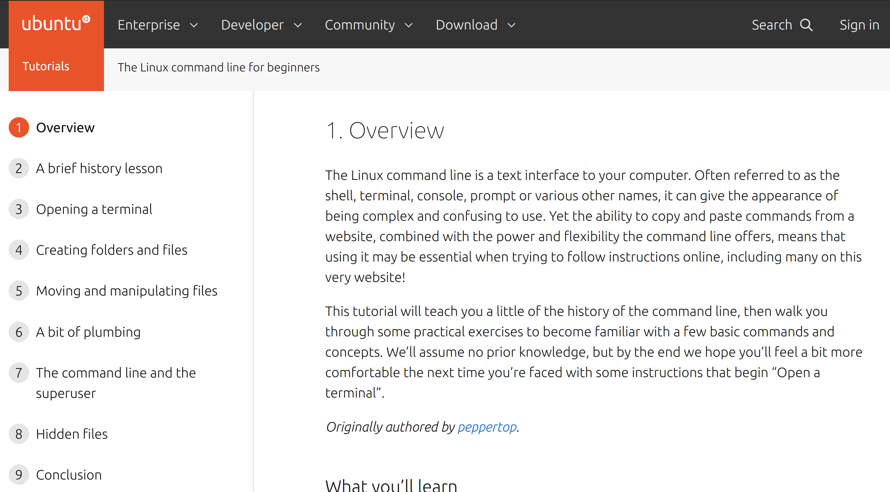

.. role:: sh(code)
   :language: sh

.. role:: cpp(code)
   :language: cpp

.. role:: cmake(code)
   :language: cmake

Tutorial
=============

This page is meant to teach new RoboCup Software members the basics of what
they'll need to contribute. It will introduce the Robot Operating System (ROS),
the command-line, GitHub, git, Python, C++, and the general shape of our stack.
Upon completion of this tutorial, you'll have the knowledge and trust of your
teammates to implement new features on your own.

No prior experience is assumed. However, a bit of stubbornness is required.
RoboCup SW has seen many members without any prior CS experience become valued
contributors, and many talented CS majors quit within a few weeks.

**Note: you must have Ubuntu 20.04 installed in some capacity to use our
stack.** Most new members do this with a VM, which is the quickest way. Google
"how to install Ubuntu VM on <your current OS>" and follow a tutorial online.
If you decide to stick with RoboCup long-term, it might be worth your time to
invest in a used laptop that only has Ubuntu 20.04 and your RoboCup files
installed.

The tutorial is structured as follows.

.. contents::

There are some gaps intentionally left in the tutorial. This is to force you to
problem-solve on your own, simulating what it feels like to write a new feature.
If the tutorial was simply a bulleted list of commands to type, it would not
prove that you're ready to work on something meaningful on your own.

When you run into issues, your order of question-asking should be:

#. Google

   * Keywords, not full sentences

   * Error messages, if they come up

#. Google

   * Seriously

#. FAQ page in our docs (common errors and debug info)

#. Fellow new members

#. Software lead

#. Anyone the SW lead takes advice from

This is not because older members don't want to help you, but because if older
members helped every new member with every question, they wouldn't have time to
make our robots better (nor would you learn as much). So try to resolve your
issue yourself, and expect to be asked "what have you tried already?" when you
ask for help.

0. Command-Line Basics
----------------------

If you've never heard of or used the command-line before, `Command Line Basics`_ is
wonderful for beginners.

The rest of this tutorial assumes you have working knowledge of the
command-line: how to run an executable, change directories, move files, run
commands, etc. So if you're uncomfortable with any of that, go through the
exercises in the site above.

Some tips about learning how to use commands:
 * :sh:`man [command]` will pull up a manpage, which is an explanation of the
   command and all of its options. This usually only works on standard Unix
   commands. For instance, you can find words in any file in a directory using
   :sh:`grep`: try :sh:`man grep` to see its full potential.
 * :sh:`[command or executable] --help` will almost always return a prompt that
   tells you what the command does, and how you can modify it with options. Many
   custom command-line tools will have a --help output, if they don't have a man
   page.
 * Of course, you can also simply Google a command you don't understand, or look
   up something like "how to search for a filename with command line".

1. Installation
---------------

See "Installation". That page will assume you have the Command-Line Basics
from above, as well as a working knowledge of Git (which you can get either
online (`Git Guide`_) or from the "Contributing"
page).

Once you've installed, play around with the simulator a little bit. Be familiar 
with how to move the ball (click), take a shot (right click and drag), move a robot
(click and drag), and issue the basic referee commands: stop, halt, and force start.
(Buttons in the top left)

2. GitHub Basics
----------------

Now that you have everything installed and understand the basics of the
command-line and git, let's get started using GitHub.

.. Note::

   git is a command line version-control tool. GitHub is a website to host
   shared files, and is well-integrated with git, but is not the same thing.

First, use git to checkout the branch that contains starter code for this
project, and then pull its latest version:

   .. code-block:: sh

      git checkout ros2
      git pull

Next, create a new branch under this naming scheme:

   .. code-block:: sh

      git checkout -b "<your-name>/robocup-sw-tutorial"

For instance, the author's branch would be named
``kevin-fu/robocup-sw-tutorial``.

Launch soccer (our UI) and the ER-force simulator, same way as you did in the 
installation guide. Press the green check mark. You should see three wallers
and one goalie move into position. Click anywhere on the field to place the 
ball in that location. You should see all five robots move between the ball
and the goal.

Open the file ``soccer/src/soccer/strategy/agent/position/waller.cpp``. 
Find the line of code that calculates the ``wall_spacing`` and double its value.

Re-build the project (:sh:`make again`) and run the simulator again. You should
see the wallers more spread out. Note that this is probably a less effective wall!
This change is just for educational purposes. 

**Take a screenshot of your new wall.***

Now that you've made a change to the repo, run ``git status``. You should see
that whatever files you changed show up in red, which indicates that they are
unstaged. Stage the files you changed with ``git add`` (Google this if unsure
how, or see the previous section on git), then commit them:

   .. code-block:: sh

      git commit -m '<commit msg>'

.. note::

   <commit msg> should be a present-tense description of what you've changed. In
   this case, "double wall spacing" is fine.

   Without the -m flag, git commit will open a nano (or whatever your
   default text editor is set to) and ask you to type in 
   a commit msg. -m is a bit faster.

When you commit, you should see our pre-commit hooks run. These are automated
programs that make your code comply with standardized style guidelines. If one
of the checks fails, simply re-add your files and re-commit. (If you don't see
this, make sure you have everything installed correctly per the installation
guide.)

Now that you've committed, run :sh:`git push` to push your changes to the remote
server. This is how GitHub sees your changes. If you run into any errors at this
step, read the error logs carefully (they often tell you what to do), and Google
if needed.

Finally, go to our GitHub page, click the "Pull Requests" tab, and create a new
draft pull request for your branch. When it asks you to fill in the PR
description, you can delete the template and write something simple like
"Completes RC SW tutorials." Add that screenshot of your four-waller setup as a
comment below your brand new PR. Nice work!

3. ROS CLI Basics
-----------------

This section is our variation of the ROS 2 `Beginner CLI Tools`_ tutorials. We
do things slightly differently (and don't use all of the ROS 2 features
described in those tutorials), so this is intended to keep you from having to
read all of those docs.

However, those docs are obviously still the source of truth on ROS. Before we
get started, read all of the short "Background" sections for these pages:

* Understanding ROS 2 nodes
* Understanding ROS 2 topics
* Understanding ROS 2 services
* Understanding ROS 2 parameters
* Understanding ROS 2 actions

The background sections put together are only a couple hundred words, and
contain very neat animated diagrams that we can't recreate here.

Now that you have some background on what ROS is and how it works, let's explore
how we use ROS in our stack. (ROS is used in place of ROS 2 in the rest of these
docs, just know that we are referencing ROS 2 every time.)

First, open up our stack, same as you did in the installation guide. (Remember
to source ROS2!) Then run

   .. code-block:: sh

      ros2 topic list

to see the list of topics. Let's look at what robot 0 is thinking. Run

   .. code-block:: sh

      ros2 topic echo /gameplay/robot_intent/robot_0

to see what's being published to that topic. You should see that robot 0 is
being given a motion_command to go to a certain position at a certain angle.
Feel free to try echoing other topics to see what they're publishing.

Now run :sh:`ros2 topic info` on the same topic to see what message type that
topic is publishing, and how many publishers and subscribers are listening to
it. For this topic, the message type is a subset of ``rj_msgs/``, which means we
wrote our own custom .msg file that this topic uses.

Your task for this section is to find the file that defines the message type
used by ``/gameplay/robot_intent/robot_0``. This will take you a long time if
you search for it manually and almost no time if you use a tool like :sh:`find`.
Once you have the right file, figure out the full filepath and add it to your
GitHub PR as a comment. Congrats! You now have a grasp of ROS CLI tools.

4. rqt Basics
-------------

The observant among you may have noticed that the last section only covered ROS
topics, even though it asked you to read about ROS nodes, services, parameters,
and actions as well. This was to set up the need to use :sh:`rqt`, a graphical
interface for the many tools ROS includes.

To use it, open a new terminal, source ROS (like you do before running our
stack), and run :sh:`rqt`. (This should have been installed with the rest of the
stack when you ran :sh:`./util/ubuntu-setup`; if not, see `Install Groovy`_.) You should see a blank
GUI pop up.

.. image:: ./_static/blank_rqt.png

To replicate what we did in the last section, go to the top, click Plugins >
Topics > Topic Monitor. This allows you to see both a list of all topics, and
see the most recent message published to any topic (by clicking the checkbox).

Now find and launch the Node Graph. You should see a large, complex node diagram
pop up. If you don't see something large and complex, make sure you have both
our AI and the ER-Force simulator running.

Zoom in on the Node Graph. You should notice and most of the nodes are actually
just duplicated across robot numbers. (For instance, notice there is a
``/planning/trajectory/robot_*`` topic for each robot.) Find the two arrows that
are labelled with robot 0's robot intent and figure out which nodes publish and
subscribe to that topic. Post your answer as a GitHub comment on your PR.
(Hint: There are **two** nodes that subscribe to this topic.)

We can also use rqt to dynamically change the behavior of our robots. Pull up
the Dynamic Reconfigure menu and click the control params. Run your runner play
from earlier. In the middle of the play, double the max velocity. You should see
the runner (and every other robot on our team) move much more quickly.

Take a screen recording of this whole process and send it to your software lead
via Slack. Feel free to play around with any other params you see!

5. Action Clients and building a position
-----------------------------------------

Background
~~~~~~~~~~~

This section introduces more concepts of ROS and our strategy. 

First, read this page and do some research if you need to get an understanding
of ROS actions. Our strategy stack is centered around an Action Server and six
Action Clients, each of which represent a robot on the field. 

Also, take a second to understand the difference between
strategy and planning in our stack. Strategy is responsible for high level decisions,
such as robot movement, kicking procedure, robot communication, and referee interaction. Planning is responsible
for taking the instructions from strategy and turning them into trajectories and commands a robot can execute,
which are relayed to our physical robots by the radio.

The Action Server is housed by the Planner node, which is the node responsible for turning requests
for robot actions into trajectories for the robot to follow.

The Action Clients are created by the AgentActionClient node which contain some 
other useful subscriptions to get information about the field and referee.

At any given time, an AgentActionClient is playing a single position. 
It creates a RobotFactoryPosition instance and checks for its task,
which it then relays to the planner using ROS actions. Take a look through ``agent_action_client.cpp`` to get a better understanding of this process. 

Strategy decisions are delegated to the Positions. This makes
sense with respect to soccer—players play differently based on their position.

There are three major positions: Offense, Defense, and Goalie. You may see
some others, but these are only for special game cases.

Robots independently make choices on what position to play via the RobotFactoryPosition.
The RobotFactoryPosition follows the factory design pattern, as it generates
different position instances (e.g., Offense) based on the game state, and returns
the relevant intent from whatever position it is playing.

Take some time to read through Offense, Defense, and Goalie, paying special 
attention to how they each implement ``state_to_task`` and ``update_state``.
This is called a finite state machine, and it is a crucial concept to get the 
hang of. Here's a simple article to get you started: `Finite State Machines`_ 

Instructions
~~~~~~~~~~~~

This is the most open-ended part of the tutorial, but you got this! 
Remember, if you get stuck, ask Google first. Then, check with your peers. We're a very collaborative
team. If you're still stuck, your software lead is happy to give you some hints
and troubleshoot bugs.

Your task is to create a new position, like Offense, Defense, or Goalie. Your
new position will be called Runner. It will be a subclass of ``position.hpp``. 

Some useful C++ resources:

* `C++ Classes`_
* `C++ Inheritance`_ 

Your runner will be a robot that takes laps around the field. It should run in a rectangle that you choose.
If you're feeling creative, the shape it runs in can be any polygon with 4 or more sides. 

A runner's process looks like this:

#. Run along first side of shape 
#. Continue until done
#. Run along second side of shape
#. Continue until done
#. Run along third side of shape
#. Continue until done

etc, starting over when it finishes the shape.

Hopefully, you're seeing how this list lends nicely to a state machine, where states are sides
and you know to switch states based on when the robot has reached a vertex (the end of its path).

You will need to look through the other positions to figure out the details of creating this position,
but here are some more hints.

* The motion command for driving in a straight line is :cpp:`"path_target"`.
* You will probably need to override some methods relating to passing, but you can leave their implementations empty. They don't need to do anything in your position, as your robot will not pass the ball
* The simulator tells you the coordinates of your cursor—these are the same coordinates you can use in your motion commands.
* You will need to add the new file name you create to ``soccer/src/soccer/CMakeLists.txt``. See how this is done for other positions.

Testing
~~~~~~~

To test your new position, the robot(s) needs to know to use it.
Recall that the RobotFactoryPosition (``robot_factory_position.cpp``) is how the robot assigns itself a position.
Take some time to review this file. RobotFactoryPosition is a subclass of Postion, just like your new runner.
However, it determines what intent to return by calling ``get_task`` on the ``current_position_`` instance, which in our case should be your runner!

You only want one Runner robot, so just set the robot with ID 1 to always be a Runner. See how this is done in the constructor with Offense.
You will also need to change other methods as well (i.e. ``set_default_position``) so the position is not overridden on later ticks.

Wrapping up
~~~~~~~~~~~
Make sure that you are periodically commiting your changes. This makes it easy for you to revert things if you need to!

Once robot 1 is successfully running in a rectangle (or other shape), you're finished! Congratulations!

6. ROS and C++
--------------

Much like Section 4, this section is our version of an official ROS
tutorial. This time we'll reprise `Writing a simple publisher and subscriber (C++)`_.
Before continuing, read the "Background" section of that tutorial, and brush up
on any of the readings from section 4 that you need to. Ignore
"Prerequisites"--our workspace is already set up for you, and we'll walk through
instructions for building your code here.

This section is by far the most difficult of the tutorial. 

**Read the rest of this section before starting.**

Objective
~~~~~~~~~

In this section, you'll be creating a SoccerMom node that gets the team color
and picks a fruit to match. Our robots have to stay motivated somehow!

You can find the team color by subscribing to the relevant topic (this should
become obvious after looking at the list of topics). To "pick a fruit", publish
a standard `String Msg`_ 
to a new topic ``/team_fruit``.
 * When our team color is yellow, publish "banana" to ``/team_fruit``.
 * When our team color is blue, publish "blueberries" to ``/team_fruit``.

Creating a New Node
~~~~~~~~~~~~~~~~~~~

Often in C++ you'll see the use of a header file, which ends in ``.hpp``, and a
source file, which ends in ``.cpp``. Header files contain all the function
declarations and docstrings explaining their use. Source files contain the
function definitions--that is, the code that actually makes the functions work.
This allows for many files to share access to the same methods or classes
without copy-pasting their entire implementation by importing the right header
files. 

(For more information, check out `Headers and Includes`_ resource.)

Let's take a look at a real example in our codebase to make this more
understandable. Find the radio.cpp and radio.hpp files in our codebase. In the
last section, you used :sh:`rqt` to launch the Node Graph. One of the nodes that
subscribe and publish to various topics is ``/radio``, and these files are the
source of that node. 

Comparing the similarities and differences between the subscribers and
publishers in these files vs. the ROS tutorial will help you learn what you can
take directly from the ROS tutorial, and where you need to deviate from it.

As a brief overview to help you get started...

* Notice the :cpp:`#includes` at the top of both files. :cpp:`#includes` are like
  :cpp:`import` statements from Java or Python (with slight differences that are
  not terribly important for our purposes right now). Using ROS forces you to
  include certain things; again, check out the ROS tutorial.

* The header file defines Radio to be subclass of rclcpp::Node (see :cpp:`public rclcpp::Node`).
  This means the Radio has access to all the methods of rclcpp::Node 
  (notice that Node is under :cpp:`namespace rclcpp`!).

* The header file also categorizes all variables and methods of the Radio
  class into :cpp:`public`, :cpp:`protected`, and :cpp:`private`. These are known
  as "access specifiers". This article on `Access Specifiers`_
  sums them up nicely.

* Both files are enclosed under a namespace. Namespaces are an organizational
  tool in C++ which helps organize large codebases. For instance, the radio.hpp
  file defines :cpp:`namespace radio`, so when other files use the :cpp:`SimRadio`
  object, they reference :cpp:`radio::SimRadio`. Give your SoccerMom node a
  :cpp:`tutorial` namespace.

* The existing codebase makes heavy use of *lambda expressions*. For instance,
  in radio.cpp:

   .. code-block:: cpp

      create_subscription<rj_msgs::msg::ManipulatorSetpoint>(
               control::topics::manipulator_setpoint_topic(i), rclcpp::QoS(1), 
               [this, i](rj_msgs::msg::ManipulatorSetpoint::SharedPtr manipulator) {
                  manipulators_cached_.at(i) = *manipulator;
               });

Here, a lambda expression is used instead of the callback function that you'll
see in the ROS tutorial. A lambda expression is just a concise way of defining
a function without giving it a name. This is only suitable when you know you
don't want to reuse a function (since without a name, you can't reference that
function anywhere else). and requires less lines of code when compared to
having another function. 

Read more about `Lambda Expressions`_
if you would like.

* The existing codebase also makes heavy use of *pointers*. You will see this
  in the use of the arrow operator, :cpp:`->`. For example:

   .. code-block:: cpp

      robot_status_topics_.at(robot_id)->publish(robot_status);

The arrow operator is used to access a method or element of an object, when
given a pointer to that object. Above, :cpp:`robot_status_topics_` is a list of
pointers to ROS publisher objects. Calling :cpp:`->publish(robot_status)` on one
element in that list publishes a robot status using that specific publisher.
You will learn more about pointers when you take CS 2110, but if you want to
get a headstart, see `C++ Member Operators`_.

* Finally, the docstrings in the radio header file state that the Radio class
  abstract superclass of the network_radio and sim_radio nodes. (If you are
  unfamiliar with the concept of abstraction, `C++ Abstract Classes`_ is more
  information.) The concrete subclasses are NetworkRadio and SimRadio.

You might be wondering: okay, this is great, but how do I compile and run my
new node?

Well, both NetworkRadio and SimRadio have an associated <name>_main.cpp file
(e.g. ``sim_radio_node_main``) which contains the main function for its
respective node. This structure is intended to make writing the CMake files for
the directory easier. We use `CMake`_ to compile
our C++ programs on a variety of different hardware architectures. 

As a result, to compile and use your new node, you'll need to add your new
source files to the right CMake files.

Building Your Node
~~~~~~~~~~~~~~~~~~

CMakeLists.txt files are used to make standard build files for the directory. It
locates files, libraries, and executables to support complex directory
hierarchies. Locate the ``CMakeLists.txt`` file in
``robocup-software/soccer/src/soccer``.

Let's start looking at all the magic CMake text that builds our cpp code:

* Notice the source files under :cmake:`ROBOCUP_LIB_SRC`. You will find the
  radio files that you explored earlier, along with all the other source
  files we use (motion control, UI, etc.).

* Many of the nodes have an environment variable set for their
  <node>_main.cpp. For instance, SimRadio has the line
  :cmake:`set(SIM_RADIO_NODE_SRC radio/sim_radio_node_main.cpp)`. This defines
  :cmake:`SIM_RADIO_NODE_SRC` to be the filepath
  :cmake:`radio/sim_radio_node_main.cpp`. You will need a similar line for
  your new node, with adjustments to the names.

* There is a corresponding :cmake:`target_sources` line that SimRadio needs to
  actually start: :cmake:`target_sources(sim_radio_node PRIVATE ${SIM_RADIO_NODE_SRC})`

The rest is up to you. Keep using SimRadio as an example. Search through and
find the parts of the CMake file where SimRadio is used, then follow that
format for your own node. 

It's okay if you don't understand everything that's going on. (Honestly, CMake
files are one of those things we re-learn when adding new nodes and forget
almost immediately after.) Just match the existing patterns.

Launching Your Node
~~~~~~~~~~~~~~~~~~~

You're almost there! The final file to get your node up and running is the
``.launch`` file.

Launch files in ROS are a convenient way of starting up multiple nodes, setting
initial parameters, and other requirements. Find the ``robocup-software/launch``
directory and open the file that seems most relevant to your new node.
(HINT: Your node should be located in ``robocup-software/soccer``.) 

Like the CMake section, this part is a lot of copying what already exists and
changing it to match your new node's names. If you want to read more about ROS
launch files, the `Launch Files Tutorial`_ is a great place to start.

Testing
~~~~~~~

Whew! What a section. If you've made it this far, you should have everything
you need to create the SoccerMom node. 

This section will probably take you a while. Remember, when you run into
issues, your order of question-asking should be:

#. Google

#. FAQ page in our docs

#. Fellow new members

#. Software lead

#. Anyone the SW lead takes advice from

.. note::

   Since you have made changes to the C++ part of our codebase, you must build
   it again to test your node. This may take a while, so be patient and
   proactive with your changes. If you forgot how to build the codebase, go to
   the Getting Started page.

To test, change our team color using the UI by going to the top menu bar and
clicking Field > Team Color. You should see the team color change in the top
right corner of our UI. Screenshot proof that your ``/team_fruit`` topic is
publishing the right fruit for both options, and post as a comment to your PR.

Similar to the Python section, there's a lot of file-finding in this part. Use
the option in your IDE or text editor that allows you to see a full folder at
once. For instance, in VS Code, there is an option to open a full folder, which
displays all the subfolders and files in the left toolbar.

If you've read this whole section and are feeling a little intimidated, that's
normal. The paragraphs above form a nice guide and checklist for you to follow.
Just try your best, one step at a time, and eventually you'll have a working
piece of software to be proud of.

7. Conclusion
-------------

Finally, tag your software lead for review on your pull request. For your final
comment, leave feedback on anything that confused you in this tutorial. When
reviewing your PR, your software lead will either request changes, meaning they
have some feedback for you to adjust your PR, or approve it, meaning your
changes are ready to merge.

However, this time, upon approval, **CLOSE your pull request. Do not merge it.**
Since this is only a tutorial project, there's no need to add it to the
codebase.

Congratulations! This was a long journey, but if you've made it this far, you
have proved yourself worthy of your teammates' trust, and are ready to work on
real features. We hope this was a helpful first step in your long robotics
career.

8. Resources (again)
--------------------

Here are all the external links from this document, copied again for your easy reference

* `Command Line Basics`_
  
.. _Command Line Basics: https://ubuntu.com/tutorials/command-line-for-beginners#1-overview

* `Git Guide`_
  
.. _Git Guide: https://rogerdudler.github.io/git-guide/

* `Beginner CLI Tools`_
  
.. _Beginner CLI Tools: https://docs.ros.org/en/foxy/Tutorials.html#beginner-cli-tools>

* `Install Groovy`_

.. _Install Groovy: http://wiki.ros.org/rqt/UserGuide/Install/Groovy

* `Writing a simple publisher and subscriber (C++)`_

.. _Writing a simple publisher and subscriber (C++): http://docs.ros.org/en/rolling/Tutorials/Writing-A-Simple-Cpp-Publisher-And-Subscriber.html

* `String Msg`_

.. _String Msg: http://docs.ros.org/en/noetic/api/std_msgs/html/msg/String.html

* `Headers and Includes`_

.. _Headers and Includes: https://cplusplus.com/articles/Gw6AC542/

* `Access Specifiers`_
  
.. _Access Specifiers: https://www.w3schools.com/cpp/cpp_access_specifiers.asp

* `Lambda Expressions`_

.. _Lambda Expressions: https://www.programiz.com/cpp-programming/lambda-expression

* `C++ Member Operators`_

.. _C++ Member Operators: https://www.tutorialspoint.com/cplusplus/cpp_member_operators.htm

* `C++ Abstract Classes`_

.. _C++ Abstract Classes: https://en.wikibooks.org/wiki/C%2B%2B_Programming/Classes/Abstract_Classes

* `CMake`_

.. _CMake: https://cmake.org/overview/

* `Launch Files Tutorial`_

.. _Launch Files Tutorial: https://docs.ros.org/en/foxy/Tutorials/Intermediate/Launch/Creating-Launch-Files.html

* `Finite State Machines`_ 

.. _Finite State Machines: https://medium.com/@mlbors/what-is-a-finite-state-machine-6d8dec727e2c

* `C++ Classes`_

.. _C++ Classes: https://www.learncpp.com/cpp-tutorial/classes-and-class-members/

* `C++ Inheritance`_ 

.. _C++ Inheritance: https://www.learncpp.com/cpp-tutorial/basic-inheritance-in-c/
