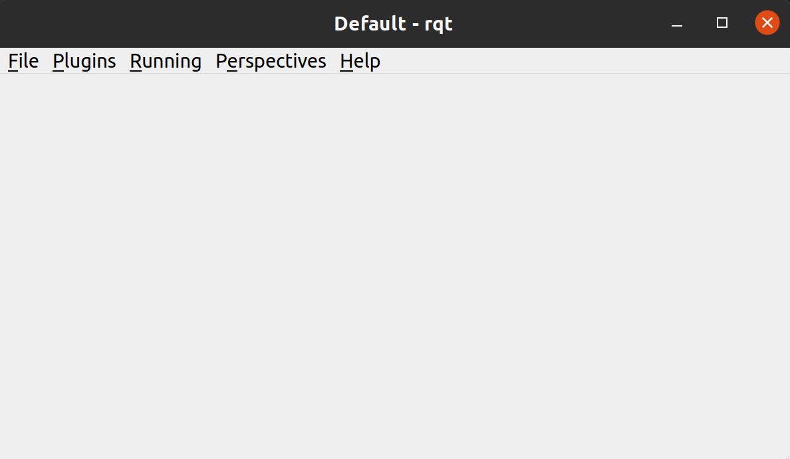

Tutorial
========

This page is meant to teach new RoboCup Software members the basics of what
they'll need to contribute. It will introduce the Robot Operating System (ROS),
the command-line, GitHub, git, Python, C++, and the general shape of our stack.
Upon completion of this tutorial, you'll have the knowledge and trust of your
teammates to implement new features on your own.

No prior experience is assumed. However, a bit of stubbornness is required.
RoboCup SW has seen many members without any prior CS experience become valued
contributors, and many talented CS majors quit within a few weeks.

The tutorial is structured as follows.

.. contents::

There are some gaps intentionally left in the tutorial. This is to force you to
problem-solve on your own, simulating what it feels like to write a new
feature. If the tutorial was simply a bulleted list of commands to type, it
would not prove that you're ready to work on something meaningful on your own.

When you run into issues, your order of question-asking should be:

#. Google

   * Keywords, not full sentences

   * Error messages, if they come up

#. Google

   * Seriously

#. Fellow new members

#. Software lead

#. Anyone the SW lead takes advice from

This is not because older members don't want to help you, but because if older
members helped every new member with every question, they wouldn't have time to
make our robots better (nor would you learn as much). So try to resolve your
issue yourself, and expect to be asked "what have you tried already?" when you ask
for help.

0. Command-Line Basics
----------------------

If you've never heard of or used the command-line before, `this website
<https://ubuntu.com/tutorials/command-line-for-beginners#1-overview>`_ is
wonderful for beginners.

.. image::

   ./_static/ubuntu_cli_tutorial.png

The rest of this tutorial assumes you have working knowledge of the
command-line: how to run an executable, change directories, move files, run
commands, etc. So if you're uncomfortable with any of that, go through the
exercises in the site above.

Some tips about learning how to use commands:
 * ``man [command]`` will pull up a manpage, which is an explanation of the
   command and all of its options. This usually only works on standard Unix
   commands. For instance, you can find words in any file in a directory using
   ``grep``: try ``man grep`` to see its full potential.
 * ``[command or executable] --help`` will almost always return a prompt that
   tells you what the command does, and how you can modify it with options.
   Many custom command-line tools will have a --help output, if they don't have
   a man page.
 * Of course, you can also simply Google a command you don't understand, or
   look up something like "how to search for a filename with command line".

1. Installation
---------------

See "Getting Started". That page will assume you have the Command-Line Basics
from above, as well as a working knowledge of Git (which you can get either
`online <https://rogerdudler.github.io/git-guide/>`_ or from the "Contributing"
page).

2. GitHub Basics
----------------

Now that you have everything installed and understand the basics of the
command-line and git, let's get started using GitHub.

.. Note::

   git is a command line version-control tool. GitHub is a website to host
   shared files, and is well-integrated with git, but is not the same thing.

First, use git to create a new branch under this naming scheme:

.. code-block:: bash

   git checkout -b "<your-name>/robocup-sw-tutorial"

For instance, the author's branch would be named
``kevin-fu/robocup-sw-tutorial``.

Then take a look at the defense play in
``rj_gameplay/rj_gameplay/play/defense.py``. Launch soccer (our UI) and the
ER-force simulator, same way as you did in the installation guide, then select
this play as the test play to see it in action. Click the green checkmark in
our UI. You should see 3 robots form a wall, 2 robots mark the opposing team,
and 1 robot play goalie.

Figure out which line(s) to change so that 4 robots form a wall instead of 3.
When done, take a screenshot of the four wallers.

Now that you've made a change to the repo, run ``git status``. You should see
that whatever files you changed show up in red, which indicates that they are
unstaged. Stage the files you changed with ``git add`` (Google this if unsure
how, or see the previous section on git), then commit them:

.. code-block:: bash

   git commit -m '<commit msg>'

.. note::

   <commit msg> should be a present-tense description of what you've changed.
   In this case, "change to 4 wallers" is fine.

   Without the -m flag, git commit will open a nano, a text editor, and ask you
   to type in a commit msg. -m is a bit faster.

When you commit, you should see our pre-commit hooks run. These are automated
programs that make your code comply with standardized style guidelines. If one
of the checks fails, simply re-add your files and re-commit. (If you don't see
this, make sure you have everything installed correctly per the installation
guide.)

Now that you've committed, run ``git push`` to push your changes to the remote
server. This is how GitHub sees your changes. If you run into any errors at
this step, read the error logs carefully (they often tell you what to
do), and Google if needed.

Finally, go to our GitHub page, click the "Pull Requests" tab, and create a new
draft pull request for your branch. When it asks you to fill in the PR
description, you can delete the template and write something simple like
"Completes RC SW tutorials." Add that screenshot of your four-waller setup as a
comment below your brand new PR. Nice work!

3. rj_gameplay and Python
-------------------------

In this section, you'll be tasked with creating a new Python class to give our
robots some new tricks on the field. This section is one of two coding-heavy
sections, and should present a significant challenge.

 * If you don't know Python, but you've coded in some other language before,
   Python is likely an easier language to learn than the one you already know.
   (Just look at some of the .py files in this repo and you'll see.)
 * If you've never coded before this club, hopefully you are in CS 1301/1371,
   and you'll start learning how to code very shortly. In that case, skip to
   section #4 for now, continue working, and come back here at the end of
   section #5 when it becomes necessary to have this section done.
 * If you've never coded before and you're not in an introductory CS course,
   you'll have to go through a Python tutorial like `this one
   <https://docs.python.org/3/tutorial/>`_ to learn the ropes.

Your task is to create a Runner Role that can make any arbitrary robot run
around the perimeter of the field. This should hopefully distract the other
team and keep them from being able to score on us. **Read the rest of this
section before starting.**

The coordinates of the field are in the ``world_state`` object that is passed
through every single gameplay element. Search the ``rj_gameplay`` folder for
``world_state.field`` to figure out how to get those coordinates--you will
eventually find the file where the field coords are passed in, and from there
it will be obvious how to use them. Do this search with ``grep``, not by hand.

A Role defines a complex, single-robot behavior, like the Goalie, or a Passer.
See the Design Docs linked in `this PR
<https://github.com/RoboJackets/robocup-software/pull/1811>`_ for more detail.
The superclass for all Roles is defined in
``rj_gameplay/stp/role/__init__.py``, and the subclasses that define actual
Roles are in ``rj_gameplay/rj_gameplay/role/``. All roles use a finite state
machine, or FSM, which is really just a good mental model for writing programs
that change over the course of time. Look at the existing files to figure out
how to structure and implement your role to use an FSM.

If you've never heard of a superclass before, see `this website
<https://www.whitman.edu/mathematics/java_tutorial/java/objects/inheritance.html>`_
for a quick introduction. If you want to learn more about FSMs, see `this link
<https://flaviocopes.com/finite-state-machines/>`_.

To test your Role, you'll have to write a Tactic that uses it, and put that
Tactic into a Play. This is a little complicated. Look at the Defense Play you
modified earlier. The Goalie Tactic in this play is really just a wrapper for
the Goalie Role (as in, it doesn't do much but call the Goalie Role and ask it
what to do). This is how your Runner Role should be included. Put it in the
Defense Play so that you have 4 Wallers, 1 Goalie, and 1 Runner.

There are many ways to assign a Role to a given robot (see the design doc
linked above for more detail). In this case, assign robot 1 to be our runner.
(That's our most in-shape robot, so they can handle the extra miles.) Do this
the same way that the Goalie Role always picks robot 0 to be the goalie.

You may have noticed there's a lot of file-finding in this section. Use the
option in your IDE or text editor that allows you to see a full folder at once.
For instance, in VS Code, there is an option to open a full folder, which
displays all the subfolders and files in the left toolbar. If you open
``robocup-software/rj_gameplay`` like this, it should be a lot easier to
navigate these files.

If you've read this whole section and are feeling a little intimidated, that's
normal. The paragraphs above form a nice to-do list for you to follow. Just try
your best, one step at a time, and eventually you'll have a working piece of
software to be proud of. You'll use this same Runner Role again later on, so
you'll get to savor your success then!

4. ROS CLI Basics
-----------------

This section is our variation of the ROS 2 `"Beginner: CLI Tools"
<https://docs.ros.org/en/foxy/Tutorials.html#beginner-cli-tools>`_ tutorials.
We do things slightly differently (and don't use all of the ROS 2 features
described in those tutorials), so this is intended to keep you from having to
read all of those docs.

However, those docs are obviously still the source of truth on ROS. Before we
get started, read all of the short "Background" sections for these pages:
 * Understanding ROS 2 nodes
 * Understanding ROS 2 topics
 * Understanding ROS 2 services
 * Understanding ROS 2 parameters
 * Understanding ROS 2 actions

The background sections put together are only a couple hundred words, and
contain very neat animated diagrams that we can't recreate here.

Now that you have some background on what ROS is and how it works, let's
explore how we use ROS in our stack. (ROS is used in place of ROS 2 in the rest
of these docs, just know that we are referencing ROS 2 every time.)

First, open up our stack, same as you did in the installation guide. Then run

.. code-block::

   ros2 topic list

to see the list of topics. Let's look at what robot 0 is thinking. Run

.. code-block::

   ros2 topic echo /gameplay/robot_intent/robot_0

to see what's being published to that topic. You should see that robot 0 is
being given a motion_command to go to a certain position at a certain angle.
Feel free to try echoing other topics to see what they're publishing.

Now run ``ros2 topic info`` on the same topic to see what message type that
topic is publishing, and how many publishers and subscribers are listening to
it. For this topic, the message type is a subset of ``rj_msgs/``, which means
we wrote our own custom .msg file that this topic uses.

Your task for this section is to find the file that defines the message type
used by ``/gameplay/robot_intent/robot_0``. This will take you a long time if
you search for it manually and almost no time if you use a tool like ``find``.
Once you have the right file, figure out the full filepath and add it to your
GitHub PR as a comment. Congrats! You now have a grasp of ROS CLI tools.

5. rqt Basics
-------------

The observant among you may have noticed that the last section only covered ROS
topics, even though it asked you to read about ROS nodes, services, parameters,
and actions as well. This was to set up the need to use ``rqt``, a graphical
interface for the many tools ROS includes.

To use it, open a new terminal, source ROS (like you do before running our
stack), and run ``rqt``. (This should have been installed with the rest of the
stack when you ran ``./util/ubuntu-setup``; if not, see `this guide
<http://wiki.ros.org/rqt/UserGuide/Install/Groovy>`_.) You should see a blank
GUI pop up.

To replicate what we did in the last section, go to the top, click Plugins >
Topics > Topic Monitor. This allows you to see both a list of all topics, and
see the most recent message published to any topic (by clicking the checkbox).

Now find and launch the Node Graph. You should see a large, complex node
diagram pop up. If you don't see something large and complex, make sure you
have both our AI and the ER-Force simulator running.

Zoom in on the Node Graph. You should notice and most of the nodes are actually
just duplicated across robot numbers. (For instance, notice there is a
``/planning/trajectory/robot_*`` topic for each robot.) Find the two arrows
that are labelled with robot 0's robot intent and figure out which nodes
publish and subscribe to that topic(Hint: There are **two** nodes that are subscribed to this topic. Remember that nodes "listen in" to the data in the topic!) Post your answer as a GitHub comment on your PR.

We can also use rqt to dynamically change the behavior of our robots. Pull up
the Dynamic Reconfigure menu and click the control params. Run your runner play
from earlier. In the middle of the play, double the max velocity. You should see
the runner (and every other robot on our team) move much more quickly.

Take a screen recording of this whole process and send it to your software lead
via Slack. Feel free to play around with any other params you see!

6. ROS and C++
--------------

Much like the last section, this section is our version of an official ROS
tutorial. This time we'll reprise `Writing a simple publisher and subscriber
(C++)
<http://docs.ros.org/en/rolling/Tutorials/Writing-A-Simple-Cpp-Publisher-And-Subscriber.html>`_.
Before continuing, read the "Background" section of that tutorial, and brush up
on any of the readings from section 4 that you need to. Ignore
"Prerequisites"--our workspace is already set up for you, and we'll walk
through instructions for building your code here.

This section is by far the most difficult of the tutorial. If you've made it
this far, though, you should have everything you need for this section *except
for* C++ knowledge. This is a real hurdle. If you already have Java or C
experience, the syntax is similar enough to where you'll be able to work
through this section, even if it takes you some time. If you aren't so lucky,
read through the sections "Basics of C++", "Program structure", and "Classes"
of `the C++ tutorial <https://cplusplus.com/doc/tutorial/>`_ and try your best. **Read the rest of this section before starting.**

In this section, you'll be creating a SoccerMom node that gets the team color
and picks a fruit to match. Our robots have to stay motivated somehow!

You can find the team color by subscribing to the relevant topic (this should
become obvious after looking at the list of topics). To "pick a fruit", publish
a `standard string msg
<http://docs.ros.org/en/noetic/api/std_msgs/html/msg/String.html>`_ to a new
topic `/team_fruit`.
 * When our team color is yellow, publish "banana" to `/team_fruit`.
 * When our team color is blue, publish "blueberries" to `/team_fruit`.

Often in C++ you'll see the use of a header file, which ends in `.hpp`, and a
source file, which ends in `.cpp`. Header files contain all the function
declarations and docstrings explaining their use. Source files contain the
function definitions--that is, the code that actually makes the functions work.
This allows for many files to share access to the same methods or classes
without copy-pasting their entire implementation by importing the right header
files. For more information, check `this <https://cplusplus.com/articles/Gw6AC542/>`_ resource.

That may have confused you. Let's take a look at a real example in our codebase
to make this more understandable. Find the radio.cpp and radio.hpp files in our codebase. In the last section, you used ``rqt`` to launch the Node Graph. One of the nodes that subscribe and publish to various topics is ``/radio``, and these files are the source of that node. Although looking at this file may be overwhelming, direct your attention to the key sections of the file that create the node. This will assist you in creating your own node.

**Key Sections**

* There are multiple `#include`s in both files. Reference between the ROS tutorial above and your objective to determine which files are needed for your node.
* Both files are enclosed under `namespace`. Look at other header-source file pairs in ``robocup-software/soccer/src`` and determine what affects the namespace. Set this up for your SoccerMom node under a folder called tutorial.
* The header file includes important information regarding class structure and inheritance (inheritance is important since the each node inherits from the rclcpp::Node class). Moreover, it has a call to the source constructor in the public access space.
* Explore all the aspects of these files that applies to your task in this section. Compare the similarities and differences between the subscribers and publishers in these files vs. the ROS tutorial.
* Notice the docstrings for the radio header file. It explains that it's the abstract superclass of the network_radio and sim_radio node. If you are unfamiliar with the concept of abstraction, `here <https://www.pythontutorial.net/python-oop/python-abstract-class/>` is more information. When exploring these two nodes, you will discover a third file named "node"_main.cpp which contains the main function for its respective node. This structure is intended to make writing the CMakeLists.txt file for the directory easier.

While those files give you a peek into structuring your node files, they don't give you insight into how our build system works. When your compiler is building our code base, `CMake <https://cmake.org/overview/>`_ allows you to forgo the need to maintain settings specific to your compiler/build environment. As a result, you need to add your node to the appropriate CMake files.

CMakeLists.txt files are used to make standard build files for the directory. It locates files, libraries, and executables to support complex directory hierarchies. Locate the CMakeLists.txt file in ``robocup-software/soccer/src/soccer``.

**Key Sections**

* Notice all the source files in the ``ROBOCUP_LIB_SRC``. You will find the radio files that you explored earlier along with other crucial source files that aid in motion control, soccer ui, etc. You will get familiar with these files as you continue to contribute to the codebase.
* Many of the nodes have an environment variable set for their "node"_main.cpp. (HINT: There is a connection between the nodes that have these variables and the nodes that are returned by the ROS CLI)
* Each of the nodes that have a source variable are added in the CMake file as `target_sources`

.. note::

   Since you have made changes to the C++ part of our codebase, you must build it again to test your node. This may take a while, so be patient and proactive with your changes. If you forgot how to build the codebase, go to the Getting Started page.

To test, change our team color using the UI by going to the top menu bar and
clicking Field > Team Color. You should see the team color change in the top
right corner of our UI. Screenshot proof that your `/team_fruit` topic is
publishing the right fruit for both options, and post as a comment to your PR.

Similar to the python section, there's a lot of file-finding in this part. Use the option in your IDE or text editor that allows you to see a full folder at once.For instance, in VS Code, there is an option to open a full folder, which
displays all the subfolders and files in the left toolbar. If you open
``robocup-software/rj_gameplay`` like this, it should be a lot easier to
navigate these files.

If you've read this whole section and are feeling a little intimidated, that's
normal. The paragraphs above form a nice guide and checklist for you to follow. Just try your best, one step at a time, and eventually you'll have a working piece of software to be proud of.

7. Conclusion
-------------

Finally, tag your software lead for review on your pull request. For your final
comment, leave feedback on anything that confused you in this tutorial. When
reviewing your PR, your software lead will either request changes, meaning they
have some feedback for you to adjust your PR, or approve it, meaning your
changes are ready to merge.

However, this time, upon approval, **CLOSE your pull request. Do not merge
it.** Since this is only a tutorial project, there's no need to add it to the
codebase.

Congratulations! This was a long journey, but if you've made it this far, you
have proved yourself worthy of your teammates' trust, and are ready to work on
real features. We hope this was a helpful first step in your long robotics
career.
