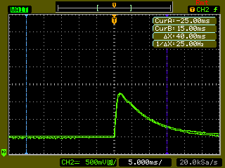
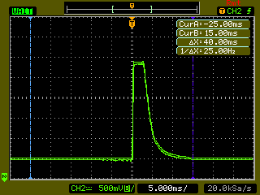
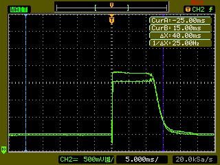

# Solenoid Analysis

This directory contains measurements for the 2011 solenoid coils that were produced using an [Agilent DSO3102A](http://www.keysight.com/en/pd-580288-pn-DSO3102A/oscilloscope-100-mhz?&cc=US&lc=eng) oscilloscope and a [kicker-2010-a](https://github.com/RoboJackets/robocup-pcb/tree/master/archive-pcb/kicker-2010-a) board modified with an [SCR](http://en.wikipedia.org/wiki/Silicon-controlled_rectifier).
* Current was measured as the voltage across a *10mohm* resistor.
* Some screenshots show current limiting by using a comparator with hysteresis to control the [IGBT](http://en.wikipedia.org/wiki/Insulated-gate_bipolar_transistor).
* The [`/firmware/robot/cpu/tools/plot-kicker`](../../tools/plot-kicker) python script is useful for analysis of the data found here.

