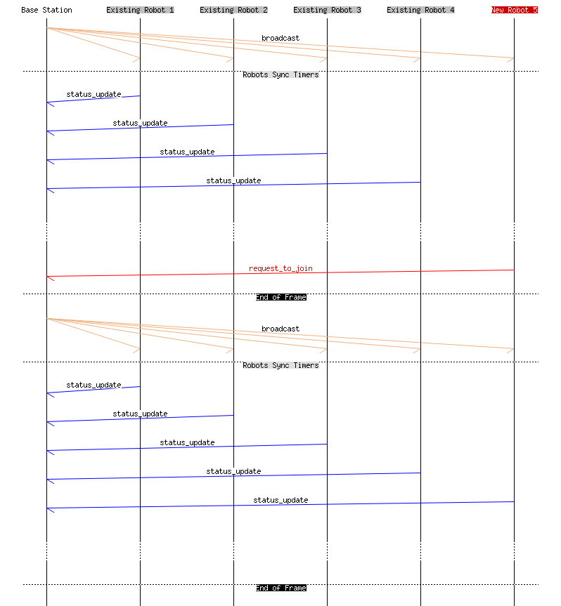

# 2015 Firmware

The [`cpu`](./cpu) directory contains the source code for the firmware.

The [`datasheets`](./datasheets) directory contains manufacture documents pertaining to many components of the electrical system.

The [`signal_captures`](./signal_captures) directory contains measurement results from the 2011 robot's electrical system. Most results are from solenoid and motor measurements.

The [`trace_captures`](./trace_captures) directory contains logic analyzer waveform results for analyzing the 2011 robot's low level controls.

The [`packets`](./packets) directory contains figures of the radio protocol's timing controls. The image below shows this by laying out how a new robot initiates the first communications to an functioning base station. For more imformation about the current status of the packet and protocol structuring, check out [this document](https://www.overleaf.com/read/kgrkbvmwphyf).

