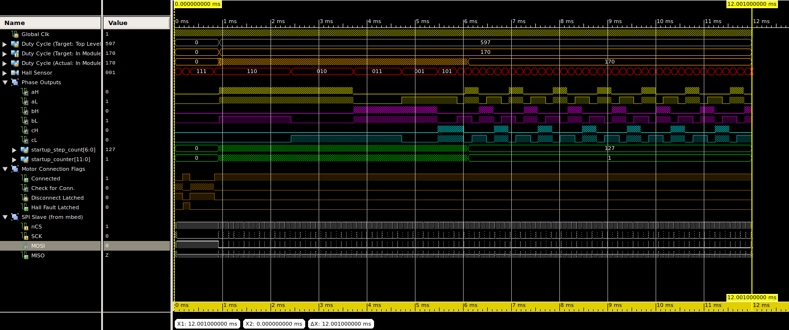

# 2015 Firmware: The FPGA

The [`src`](./src) directory contains the Verilog source files. When synthesized, these files generate a bitfile that will tell the FPGA how to configure transistors in the circuit after a robot is turned on.

The [`sim`](./sim) directory contains simulation files. Simulations help us determine if real-world results will perform how we expect them to without loading anything into hardware (or if there's no FPGA nearby...).


## Synthesizing the Verilog

Using a machine configured with the correct [Xilinx tools](http://www.xilinx.com/support/download/index.html/content/xilinx/en/downloadNav/design-tools.html) for systhesis, here's how you can synthesize the FPGA's binary file that it needs at startup.

```shell
# synthesize only
make fpga

# synthesize and upload to all connected mbeds
make fpga-prog
```

## Simulating Verilog

If you'd like to test out your skills with HDL languages, you can do that too! Simulations will be your best buddy for anything halfway related to this stuff.

Here's what a few of the top-level signals for the verilog look like during simulations. Don't worry, it's a lot less scary interpreting these waveforms for code that you've written.


One of the programs that you can use for simulations is included with [Xilinx ISE](http://www.xilinx.com/support/download/index.html/content/xilinx/en/downloadNav/design-tools.html). If your computer can't run the commands in the section before this one, you'll need to go ahead and get that setup before moving on.

To run the simulations, startup the ISE GUI from the command line and create a new project. This is assuming you installed everything under `/opt/`.

```shell
# source the Xilinx environment
. /opt/Xilinx/14.7/ISE_DS/settings64.sh

# start the ISE GUI
ise &
```

At this point, you'll see the program window open, and you can create a new project and add all of the files here to setup everything.
