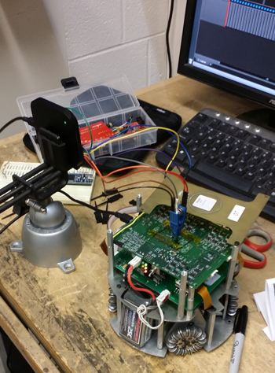

# Logic Analyzer Trace Captures

This directory contains logic analyzer data exports for different areas of the RoboCup robot. The [Saleae](https://www.saleae.com/) [*Logic16 USB Logic Analyzer*](https://www.sparkfun.com/products/retired/10989) was the device used to capture the traces. The computer used for interfacing with the [Logic16](https://www.sparkfun.com/products/retired/10989) was running [Ubuntu 14.04](http://www.ubuntu.com/download/desktop). The software used was [Saleae's](https://www.saleae.com/) [*Logic*](https://www.saleae.com/downloads) program (1.1.34). The files with a `*.logicdata` extension are the saved files from the [*Logic*](https://www.saleae.com/downloads) program. The corresponding `*.csv` files contain the raw data from the captured waveform.

The program's [configuration file](./program_settings.logicsettings) is included, but it is not needed for properly viewing the `*.logicdata` files

**It is highly recommended to use the [*Logic*](https://www.saleae.com/downloads) program for viewing the waveforms from the original** `*.logicdata` **files.**

## Testing Environment Overview

The following image was taken during the 2nd round of trace capturing to document and show how the control board was interfaced to the logic analyzer's probes.

The following table provides information about each trace capture and identifies each file's controlled variables.

| File Name | Communication Description | Control Board Version  | Kicker Board Connected | Drive Motors Connected | Dribbler Motor Connected | Ball Sensor Connected | Sampling Frequency | Duration |
| :---------------------|:----------------------------------------------|:-------------------:|:-----------:|:----------:|:-----------:|:-----------:|:-----------:|:-----------:|
| [`trace_capture_01.logicdata`](./trace_capture_01.logicdata) [`trace_capture_01.csv`](./trace_capture_01.csv) | <ul><li>No base station</li><li>Only robot's startup routine</li></ul> | 2011 Ver. C | No | No | No | No | 40MHz | 3 sec. |
| [`trace_capture_02.logicdata`](./trace_capture_02.logicdata) [`trace_capture_02.csv`](./trace_capture_02.csv) | <ul><li>Empty packets from base station</li><li>Soccer UI open</li>No ssl-vision</li></ul> | 2011 Ver. C | No | No | No | No | 50MHz | 10 sec. |
| [`trace_capture_03.logicdata`](./trace_capture_03.logicdata) [`trace_capture_03.csv`](./trace_capture_03.csv) | <ul><li>Field computer with game controller</li><li>Soccer UI open & running play</li>No ssl-vision</li></ul> | 2011 Ver. C | No | No | No | No | 50MHz | 10 sec. |
| [`trace_capture_04.logicdata`](./trace_capture_04.logicdata) [`trace_capture_04.csv`](./trace_capture_04.csv) | <ul><li>Field computer with ssl-vision & Soccer</li><li>2 robot shells on field</li>Soccer *running* a play</li></ul> | 2011 Ver. C | No | No | No | No | 50MHz | 10 sec. |
