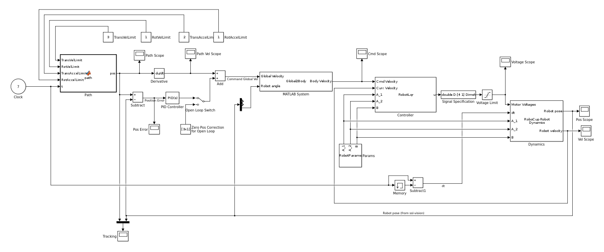
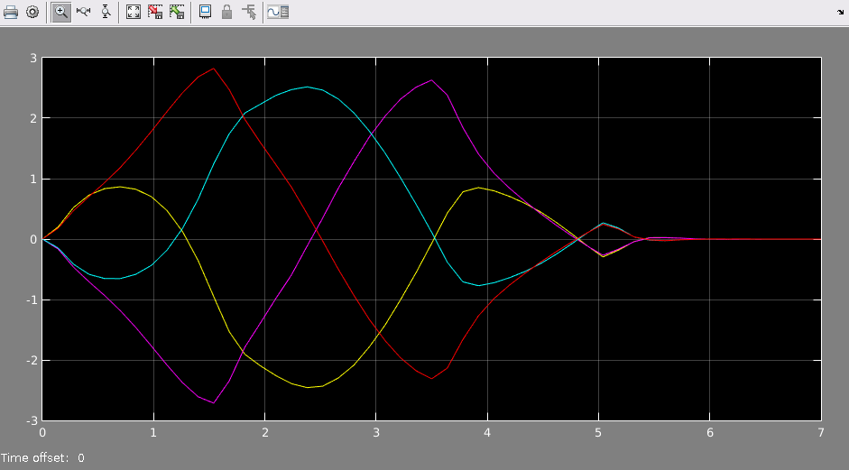
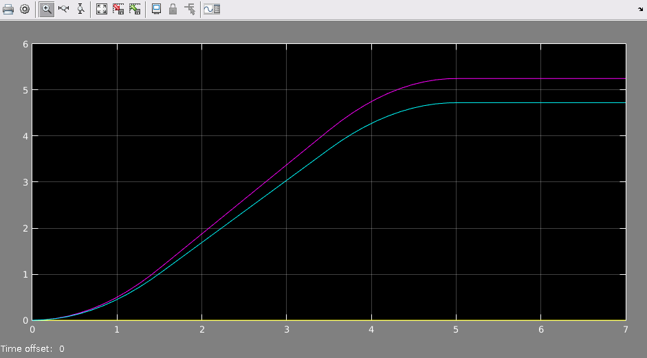
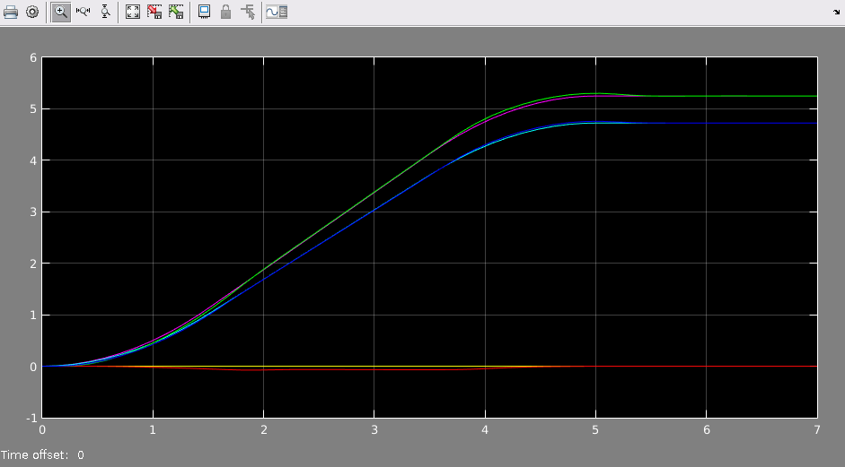

# MATLAB / Simulink Robot Control Modeling

The files in this directory are for a robot dynamics and control simulation in MATLAB Simulink.  Open the [robocup_model.mdl](robocup_model.mdl) file in Simulink to view the block diagram shown below.

## Running the simulation

Open the Simulink block diagram and click the "Run" item under the "Simulation" menu or click the green run button in the toolbar.  To see the robot's tracking performance, click on the "Tracking" scope block in the bottom left.

## Robot Parameters

There is a custom Simulink block called [RobotParams](RobotParams.m) that contains information such as the mass of the robot, moment of inertia, motor properties, etc.  These can all be set for the robot you wish to simulate.

## Robot Dynamics Model

The dynamics of the system are modeled by the "RoboCup Robot Dynamics" block in the diagram, which is implemented in the [Robot.m](Robot.m) file.  It accepts the robot parameters and motor control voltages as inputs, then evolves the system over the given time step.  It then outputs the new global position of the robot and the robot's body velocity.

## LQR Controller

The robot in the simulation is controlled by a Linear Quadratic (LQR) controller which calculates the "optimal" control input to the motors based on a cost function.  You control this cost function by providing weights for the state and control inputs.  You can find more info on how this works on [wikipedia](http://en.wikipedia.org/wiki/Linear-quadratic_regulator).  In our simulation, the values of Q and R can be tuned by double-clicking on the RobotLqr block in the diagram.

The robot receives a command body velocity over radio from soccer, then feeds this into the LQR Controller to calculate motor voltages.  The LQR Controller is implemented in the [RobotLqr.m](RobotLqr.m) MATLAB file.

Below is a graph of the output control voltages over time, as calculated by the LQR Controller for an example path:

## Paths

There is a block in the model for setting the desired path for the robot.  The block takes in dynamic constraints for the robot and the current time and returns a position (x, y, theta column vector).  Double click on this block to view or modify the path.

Below is an example path that the controller was tested against:

## Scopes

Simulink has blocks called "scopes" that plot a signal over time.  There are several scopes scattered throughout the diagram to view different parts of the simulation.  Double click on a scope block to show the graph.  Probably the most useful graph in the simulation is the one labeled "tracking", which plots the desired position vs the robot's actual position.

Below is a graph of the robot's tracking performance over time.  When running Simulink, clicking the settings button in the corner will tell you what value each colored line corresponds to since they're not labeled in the graph.  The tracking performance int his example is very good, as can be seen by the fact that there are three pairs of lines that only deviate slightly at the points where acceleration changes.

