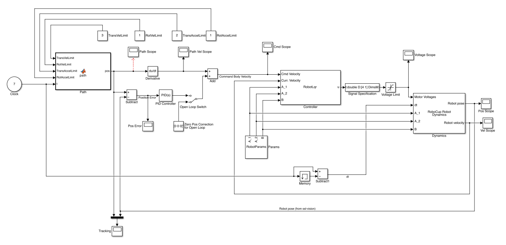

# MATLAB / Simulink Robot Control Modeling

The files in this directory are for a robot dynamics and control simulation in MATLAB Simulink.  Open the robocup_model.mdl file to view the block diagram shown below.

## Robot Parameters

There is a custom simulink block called RobotParams that contains information such as the mass of the robot, moment of inertia, motor properties, etc.  These can all be set for the robot you wish to simulate.

## Controller Paramters

The robot in the simulation is controlled by a Linear Quadratic (LQR) controller which calculates the "optimal" control input to the motors based on a cost function.  You control this cost function by providing weights for the state and control inputs.  You can find more info on how this works on [wikipedia](http://en.wikipedia.org/wiki/Linear-quadratic_regulator).

Note: Be careful not to set the weight for rotational velocity too high or else the system will become unstable and oscillate.

## Paths

There is a block in the model for setting the desired path for the robot.  The block takes in dynamic constraints for the robot and the current time and returns a position (x, y, theta column vector).  Double click on this block to view or modify the path.
