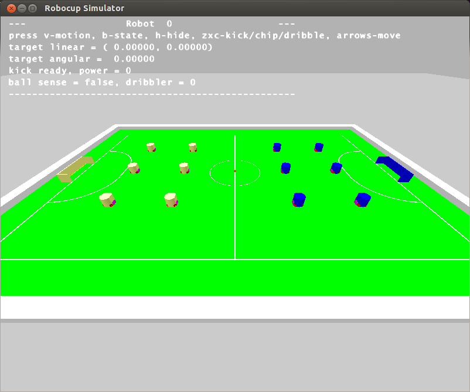

# simulator

The easiest way to try out the soccer program and test new plays is to use the simulator.




## Command-line options

The simulator program initializes itself based on an XML config file.  You can specify which config file to use with the '-c' flag:

```
$ ./simulator [-c <config file>]
```

If no config file is specified at launch, the simulator looks for a file named 'default.cfg' in the current directory.
